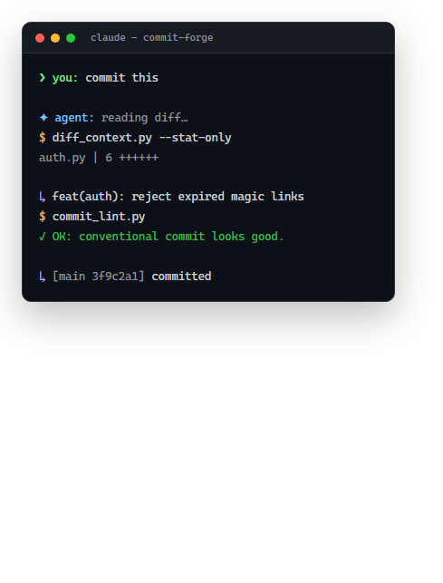

# commit-forge

> Turn your AI agent's messy diffs into conventional commits, review-ready PRs,
> and changelogs — the skill every Claude Code / Cursor / Codex / Gemini CLI user needs.

[](LICENSE)
[](#)
[](https://www.conventionalcommits.org/)

<p align="center">
  
</p>

---

AI coding agents are great at writing code. They are **terrible at committing
it** — every repo ends up with a graveyard of `fix: update stuff`, blank PR
descriptions, and changelogs that never get written.

`commit-forge` is a single installable **Agent Skill** that fixes that. It reads
the *real* diff, writes a specific Conventional Commit, lints it, scaffolds a
PR a reviewer can actually read, and drafts your changelog.

---

## Install

One line, works with every agent that loads `SKILL.md`:

```bash
# git clone into your agents' skill directory
git clone https://github.com/connectjackofficial-source/commit-forge.git \
  ~/.claude/skills/commit-forge
```

Or on Windows (PowerShell):

```powershell
git clone https://github.com/connectjackofficial-source/commit-forge.git `
  "$env:USERPROFILE\.claude\skills\commit-forge"
```

Then just talk to your agent:

> "commit this", "open a PR", "update the changelog"

## What you get

| Before | After |
| --- | --- |
| `fix: update stuff` | `feat(auth): reject expired magic links after 10 min` |
| Empty PR body | Summary + why + test steps + risk/rollback |
| No changelog | Keep-a-Changelog draft from your `feat`/`fix`/`perf` commits |

## Usage

```bash
# See exactly what changed (cheap: stats only)
python scripts/diff_context.py --stat-only

# Validate a commit message before you commit
echo "feat(api): handle null refresh token" | python scripts/commit_lint.py

# Scaffold a review-ready PR body
python scripts/pr_body.py

# Draft changelog entries since the last tag
python scripts/changelog.py
```

The skill orchestrates these for you — you just say "commit" or "open a PR".

## How it works

```
diff_context.py  ──►  reads staged changes + recent commit style
                       (so the message matches YOUR repo's voice)
        │
        ▼
   you draft a conventional commit
        │
commit_lint.py   ──►  enforces Conventional Commits 1.0.0
        │
        ▼
   commit / pr_body.py scaffolds review-ready PR
        │
        ▼
changelog.py     ──►  Keep-a-Changelog block for the release
```

## Repository layout

```
commit-forge/
├── SKILL.md                  # the skill your agent loads
├── scripts/
│   ├── diff_context.py       # structured diff context
│   ├── commit_lint.py        # conventional-commits linter
│   ├── pr_body.py             # review-ready PR template
│   └── changelog.py          # Keep-a-Changelog drafts
└── README.md
```

## Requirements

- Python 3.8+
- `git` on PATH
- An agent that reads `SKILL.md` (Claude Code, Cursor, Codex, Gemini CLI, Doubao, …)

## License

[MIT](LICENSE)
